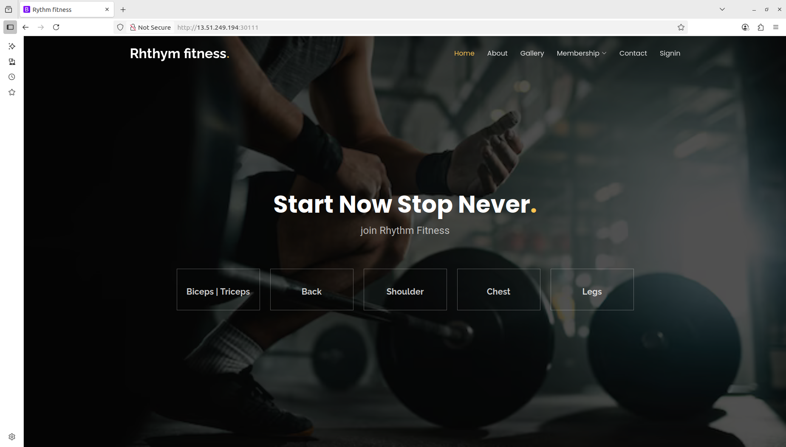

# 🚀 **DevOps Project: GYM Application Deployment**

 **This is my own Devops Project. Developer only push the project code to github and all other files like dockerfile ,jenkinsfile and requirements.txt are created by me.**

 ## **Phase 1: Initial setup and Deployment**

**Step 1: Launch EC2 (ubuntu 22.04)**

- Provision an EC2 instance on AWS with Ubuntu 22.04,volume 29gb,t3.large. 
- Connect to the instance using SSH.
- Allow ports

  -  SMTP 25
  - CUSTOM TCP 3000 - 10000
  - HTTP 80
  - HTTPS 443
  - SSH 22
  - CUSTOM TCP 6443
  - SMTPS 465
  - CUSTOM TCP 30000-32676
  - CUSTOM TCP 8000


 **step 2: clone the repository**

 ```bash
 git clone https://github.com/didin2003/Gym-app.git
 ```


```bash
cd project-name
```

**step 3: Create and Activate virtual environment**

```bash
python3 -m venv venv
source venv/bin/activate
```

**step 4: Identify the dependency**

In this Project  django, pillow

```bash
pip install django
pip install Pillow
```

```bash
pip freeze > requirements.txt
```


**step 7: Runs the Commands**

```bash
python manage.py migrate
python manage.py runserver 0.0.0.0:8000
```

It will generate an ip copy ip and paste it on the terminal.

`<16.16.201.21:8000>`

### **Deploy the Application on Docker** 

**create a docker file**
```bash
nano dockerfile
```

```bash
# Use official Python image
FROM python:3.11-slim

# Set environment variables
ENV PYTHONDONTWRITEBYTECODE 1
ENV PYTHONUNBUFFERED 1

# Set work directory
WORKDIR /app

# Install dependencies
COPY requirements.txt /app/
RUN pip install --upgrade pip && \
    pip install -r requirements.txt

# Copy project files
COPY . /app/

# Collect static files (optional, for production)
# RUN python manage.py collectstatic --noinput

# Expose port 8000 for Django
EXPOSE 8000

# Run migrations and then start Django server
CMD ["/bin/sh", "-c", "python manage.py migrate && python manage.py runserver 0.0.0.0:8000"]
```

Deploying on docker is shown on [Gym-app](https://github.com/didin8080/Gym-app.git) 

All the documents are there in the Github repository.


### **If you edit anything on settings.py you want to rebuild the docker** 

### **Deploy the Application on kubernetes**


```bash
nano deployment.yaml
```

```bash
apiVersion: apps/v1
kind: Deployment
metadata:
  name: gym-app
spec:
  replicas: 2
  selector:
    matchLabels:
      app: gym-app
  template:
    metadata:
      labels:
        app: gym-app
    spec:
     containers:
       - name: django
         image: didin8080/gym-app:latest
         ports:
           - containerPort: 8000
```

```bash
nano service.yaml
```

```bash
apiVersion: v1
kind: Service
metadata:
  name: gym-service
spec:
  type: NodePort
  selector:
    app: gym-app
  ports:
    - protocol: TCP
      port: 80
      targetPort: 8000
      nodePort: 30111
```

### Deploy it on ArgoCD 

Install helm


Configure ArgoCD
 

 Configuration is on the repository [Gym-app](https://github.com/didin8080/Gym-app.git) 


 At last the output should be like this 
 
 
 `<node-ip:30111>`
 
 `30111` port number that we have mentioned on servive.yaml file 
 
 
 
 <div align="center">
 
 <p align="center"> homepage </p>